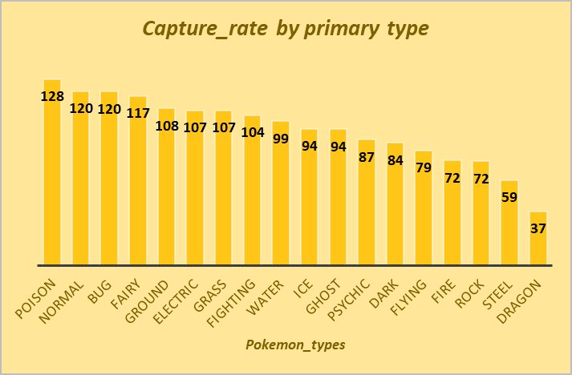
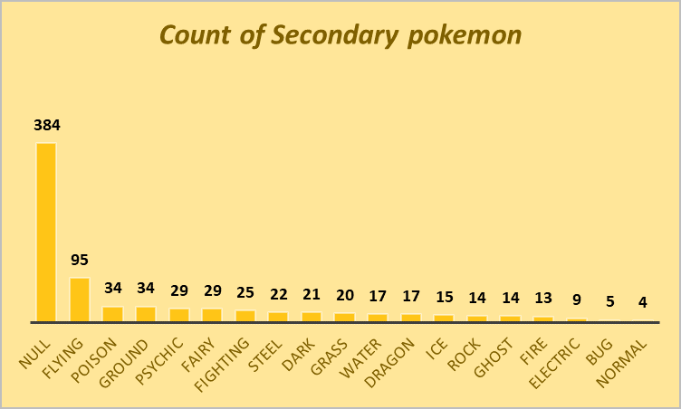

# Expository-analysis-on-Pokemon-dataset

## INTRODUCTION 
This is a data analysis study on the **Pokemon**. It’s a study I found interesting because I realized I would perform statistical analysis in achieving my results, alongside other data manipulations and data visualizations. This is a good practice for exploratory data analysis and would also enhance my data analytic skills.
## DATA
This dataset contains 41 columns and 801 rows of information concerning Pokemons from Seven Generations, their types, abilities, legendary classifications and base_statistics. Considering how diverse Pokemon is, I was interested in analysing this dataset to find answers to some questions as listed below. This data set can be found on Kaggle as “pokemon data set”.
## PROBLEM STATEMENT 
The aim of this analysis was to find  answers to these questions 
1. How does the speed of Pokemon relate to various base factors?
2. What is the count of pokemon per generation?
3. How many types of pokemon are there in each generation?
4. Which type has the easiest pokemon to catch?
5. How does the height and weight of a Pokemon correlate with its various base stats?
6. What factors influence the experience growth and eggsteps? Are these quantities correlated?
7. Which type is the most likely to be a legendary pokemon
8. What are the most widespread types of pokemon in both primary and secondary types?
9. Which type of pokemon is the strongest overall? Which is the weakest
## DATA CLEANING
Using excel, I explored the data set and carried out several data transformations on the data before finally resuming my analysis they included deleting columns I considered not necessary for my analysis, I deleted all the against stats, Japanese name, percentage_male then created a new column for no of abilities and replaced the empty cells in type2 with “Null” since not all types of pokemons have a second type. Overall, this dataset was a fairly clean and straight forward. 

## ANALYSIS
1.	How does the speed of Pokemon relate to various base factors?
 

From the correlation table above, you easily infer that. Speed has a moderate correlation with base_total and fair correlation with sp_attack while it has poor correlation with attack while it has terrible correlations with the other stats like defense, hp, sp_defense.

2.	What is the count of pokemon per generation?

The 5th generation has the highest amount of pokemon closely followed by the 1st generation as showed above.

3.	How many types of pokemon are there in each generation? 

Of the 18 types of pokemon present in the dataset only 11 are present in all 7 generations while the flying type pokemon (present in only 2 generations) is the least present in all generation.

4.	Which type has the easiest pokemon to catch?

Capture_rate is the rate of difficulty to capture any of the pokemons types. A bar graph of average capture_rate of the pokemon types was plotted against pokemon types using pivot table and as shown above **Poison Pokemon** has the highest capture rate making it the easiest to capture while Dragon type is the most difficult to capture with the least capture rate.

5.	How does the height and weight of a Pokemon correlate with its various base stats?

I correlated the weight and height against the base stats and it can be inferred that **height has a good correlation with base total (0.534)**, **hp and attack are fairly correlated with height (0.478, 0.421 resp)** and the others are weakly correlated. While only base_total, defense and hp are fairly correlated with weight, the other base_stats are weakly correlated

6.	What factors influence the experience growth and eggsteps? Are these quantities correlated?

From the above it is observed that base_egg_steps correlate moderately with base_total, weight and SP_attack but has a high correlation with legendary status of the pokemons, while experience growth is strongly negatively correlated with base happiness and weakly correlated to all other factors its was paired with. Finally, all the factors that has any form of correlation with base_egg_steps and experience_growth are all weakly correlated to the other.

7.	Which type is the most likely to be a legendary pokemon

8.	What are the most widespread types of pokemon in both primary and secondary types?

 

The water type pokemon is the most widespread amongst the primary pokemon (type1) while the least is the flying pokemon. 

 
 
The flying type pokemon is the most widespread amongst the secondary pokemon (type2) while the least is the normal pokemon but a higher percentage of pokemon have no secondary type as shown by the high Null values.

9.	Which type of pokemon is the strongest overall? Which is the weakest.
The strengths and weaknesses of the pokemon are dependent on the six base stats which adds up as the base_total. Armed with this information I used MIN and MAX functions to find the highest and lowest base total in the base total column, after which I used vlookup to find out the strongest Pokemon type (i.e having the highest base total) and the weakest (i.e the lowest base total).

MAX(I2:I802) = 780               MIN(I2:I802) = 180                                                                                                              
VLOOKUP(780,I1:T802,11,FALSE) = “psychic” type pokemon with a “genetic” classification  and named “mewtwo”                                                                                
VLOOKUP(180,I1:T802,11,FALSE)  = grass type pokemon with a seed classification and named “sunkern”                                                                                        

## Conclusion
In conclusion, I found this a very challenging dataset to work on as it was a totally new niche for me both field wise (gaming) and approach wise (statistics), I literally had to check up the meanings of most of the column headers and also brushing up on my basic statistics to better understand how to answer each question.

